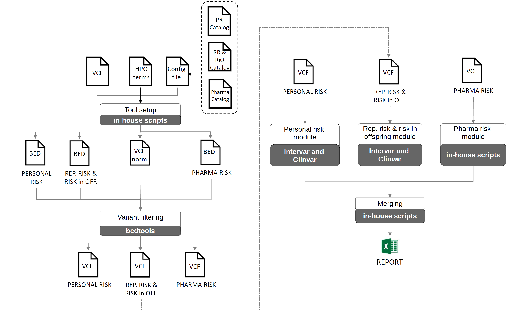

# Secondary Findings Tool

## Overview

This repository contains a novel tool (SFtool) designed for the automated management of secondary findings. It enables users to analyze VCF (Variant Call Format) files for automatic management of secondary findings related to personal risk, reproductive risk and risk in offspring and pharmacogenetics.

## <a name="TOC">Table of content</a>
 * [Introduction](#introduction)
 * * [Tool workflow](##workflow)
 * [Dependencies](#dependencies)
 * [Installation](#installation)
 * [Usage](#usage)
   * Running from source code
   * Running from singularity image
 * [Outputs](#outputs)
 * [Contributors](#contributors)


## <a name="introduction">Introduction</a>
Next Generation Sequencing (NGS) has experienced unprecedented development over the past decade, leading to significant advancements in understanding the mutational spectrum of diseases, especially rare diseases caused by (usually coding) high-penetrance variants. Currently, more than 4500 monogenic 
diseases can be diagnosed using NGS, and this capability may soon extend to all genetically based rare diseases. Genome sequencing provides an opportunity for opportunistic genomic screening (OGS), which involves the deliberate analysis of the genome for conditions unrelated to the initial indication for testing, 
which however could be relevant for the health prospects and/or reproductive choices of the patient or the patient’s family (so-called **‘secondary finding’**; SFs). Despite the relevance of OGS, there are no bioinformatic tools available that automatically handle the search for secondary findings on a 
relevant set of genes while also offering a user-friendly and simple interface.

SFtool is intended to identify and manage secondary finding from NGS data according to three main categories:
1. **Personal Risk Category**: based on the American College of Medical Genetics and Genomics (ACMG) guidance for reporting secondary findings (v3.2, [Miller DT et al, 2023](https://pubmed.ncbi.nlm.nih.gov/37347242/)), this category comprises a list of gene-phenotype pairs classified in four main 
groups: 28 genes related to cancer phenotypes, 40 genes related to cardiovascular phenotypes, 4 genes related to inborn errors of metabolism and 9 genes related to miscellaneous phenotypes (hyperthermia, hemochromatosis, among others).
2. **Reproductive Risk and risk in offspring**: this category includes 113 genes related to various conditions such as Cystic Fibrosis, Retinitis pigmentosa, Friedreich ataxia (among others), based on ACMG resources. It is intended to identify individuals or couples at risk of having health problems 
prior or during pregnancy or having a child with an autosomal recessive or X-linked genetic disorder, following ACMG for carrier screening ([Gregg AR et al., 2021](https://pubmed.ncbi.nlm.nih.gov/34285390/)).
3. **Pharmacogenetic category**: this category is based on a list of genetic variants with pharmacogenetic risks, detailing how specific genetic variations may affect drug metabolism or response. The list comprises 91 genomic variants in 17 different genes according to Levels 1A and 1B of PharmGKB
([Thorn CF et al., 2013](https://www.ncbi.nlm.nih.gov/pmc/articles/PMC4084821/)), a resource that curates knowledge about the impact of genetic variation on drug response. As a proof of concept, five therapeutically relevant genes with less complexity -TPMT, NUDT15, DPYD, CYP2C9 and CYP2C19- are analyzed further. 
For these genes, diplotypes are inferred according to genetic variants, known as star alleles, following PharmGKB and Clinical Pharmacogenetics Implementation Consortium (CPIC) recommendations ([Relling et al., 2011](https://pubmed.ncbi.nlm.nih.gov/21270786/)).


### <a name="workflow">Tool workflow</a>
SF tool generates a report that contains secondary findings found in a VCF file for each category. The general workflow is show below:
The tool, written in Python, processes a list of SNPs and small Indels (insertions or deletions < 50bps) in VCF format and runs the modules for the identification of personal, reproductive/offsping and/or pharmacogenetic variants.



After a series of checks and the normalization of the VCF file, the program generates three JSON and BED files with the corresponding chromosomal regions for each of the 3 categories. Subsequently, 3 different VCF files are generated, each containing the identified variants only in the regions to be studied for each category. Next, each of the risk modules is executed:

- **Personal Risk:** Identifies variants in the corresponding regions that are pathogenic or likely pathogenic according to the ACMG classification given by Intervar. In the advanced mode of the tool, it also obtains those variants cataloged by ClinVar as pathogenic, likely pathogenic, or conflicting (labeled as conflicting) with 
at least one pathogenic evidence. ClinVar reports the review level of these interpretations with a review status from 0 to 4, where 0 are variants without assertion criteria and 4 are those included in clinical practice guidelines. The tool allows flexibility in this level of evidence (by default, the tool takes 1 as the level of evidence).

- **Reproductive Risk and Offspring Risk:** Same criteria as in the case of Personal Risk, but applied to the genomic variants found in genes of this catalog.

- **Pharmacogenetic Risk:** Identifies the variants that are in the selected variants list for this category. Next, 5 genes of interest are selected due to their therapeutic relevance and lower complexity according to the recommendations of the corresponding WP: CYP2C19, CYP2C9, DPYD, NUDT15, and TPMT. The tool will determine the diplotype for each of these
genes based on the identified variants and the corresponding allele nomenclature tables. These tables contain information about the variants that define each haplotype and are available on the PharmGKB website, according to the SEFF recommendations. Next, the phenotype is assigned based on the diplotype-phenotype correspondence of PharmGKB-CPIC for each of these 5 genes.


## <a name="dependencies">Dependencies</a>

SFtool is designed to work in a Linux environment. Before using the tool, please ensure you have the following prerequisites:
* [Python](https://www.python.org/). Make sure you have Python 3.8 or higher installed. You can check your Python version by running
```
python --version
```
If Python is not installed, you can download it from the official Python [website](https://www.python.org/downloads) or use your system's package manager
* Python libraries: [vcfpy](https://pypi.org/project/vcfpy/) (for both reading and writing VCF files in Python) and [pybedtools](https://daler.github.io/pybedtools/) (for genomic interval manipulation)
* [Intervar](https://github.com/WGLab/InterVar). Intervar is a bioinformatics software tool for clinical interpretation of genetic variants by the ACMG-AMP 2015 guidelines
* [ANNOVAR](https://annovar.openbioinformatics.org/en/latest/). ANNOVAR, which is used by Intervar, is an efficient software tool to utilize update-to-date information to functionally annotate genetic variants detected from diverse genomes (including human genome hg18, hg19, hg38, as well as mouse, worm, fly, yeast and many others). 
* [bcftools](https://samtools.github.io/bcftools/bcftools.html). bcftools is a suite of tools for variant calling and manipulating files in the Variant Call Format (VCF) and its binary counterpart BCF
* [Bedtools](https://bedtools.readthedocs.io/en/latest/). Bedtools is a fast, flexible toolset for genome arithmetic.


Additionally, SFtool makes use of data from the following sources:
* [Clinvar](https://www.ncbi.nlm.nih.gov/clinvar/).  ClinVar aggregates information about genomic variation and its relationship to human health. variant_summary.txt file is used in SFtool, which is A tab-delimited report based on each variant at a location on the genome for which data have been submitted to ClinVar. By default, 
database downloaded on 2024/05/28 is used, but the latest version can be downloaded when running the tool. More information can be found [here](https://ftp.ncbi.nlm.nih.gov/pub/clinvar/README.txt)
* Gene to phenotype information downloaded from [Human Phenotype ontology](https://hpo.jax.org/). This file contains correspondence between HPO, Genes and OMIM terms. This file is used for linking secondary findings found in genes that can be related to the HPO terms introduced by the user. By default, the file downloaded on 2024/04/26 is used.
More information can be found [here](https://hpo.jax.org/data/annotation-format)
* Information downloaded from the [Online Catalog of Human Genes and Genetic Disorders](https://omim.org/) used by ANNOVAR . mim2gene.txt file has been downloaded, which provides links between the genes in OMIM and other gene identifiers. By default, the file downloaded on 2024/05/29 has been used.
* Reference genome hs37d5. Currently, the tool only works for this genome version, although it will support reference genome 38 in the near future.

## <a name="installation">Installation</a>

User can install the dependencies mentioned above and run the main script (SFtool.py). However, to avoid the tedious task of downloading and/or installing all the dependencies and ensuring they are available for their proper use in the tool, a Dockerfile is available so that all dependencies and databases are installed and made available for the proper execution of the tool.
Besides, giving the users' restrictions in HPC environments, a singularity image can be generated from the docker image generated. For this purpose, a four-step installation is required: 
1) Install docker. You can find some help for the installation of Docker for Linux in the following [link](https://docs.docker.com/)
2) Install singularity. In the following [link](https://apptainer.org/admin-docs/master/installation.html) you can find information on how to install.
3) Download repository:
```
git clone https://github.com/babelomics/secondaryfindings
cd secondaryfindings
git checkout develop
```
3) Download ANNOVAR. **Important**: ANNOVAR can not be offered as part of the dockerfile. Although it is freely available, a license agreement must be filled. Please, download ANNOVAR from the following [link](https://www.openbioinformatics.org/annovar/annovar_download_form.php) and place 
*annovar.latest.tar.gz* file into *docker_files* folder from the repository. 
4) Creating docker image from Dockerfile:

```
docker build --no-cache . -t sftool/singularity
```
In case you are updating your image, not that you can remove previous image as:

```
docker rmi sftool/singularity
```

5) Convert docker image to singularity and save in a file to be transferred to the cluster. This conversion can be done as:
```
SINGULARITY_NOHTTPS=1 singularity build sftool.sif docker-daemon:://sftool/singularity:latest
```
where sftool.sif contains the converted singularity image.

## <a name="Usage">Usage</a>

### Running from source code
SFtool can be run from the command line with various options to customize its behavior. Before running it, you have to 
configure some parameters in the *config.json* file contained in *modules/misc* folder from the repository:

* *categories_path*: path to *secondaryfindings/categories/* folder. This path addresses gene/variants information for each category.
* *clinvar_path*: path to CLINVAR database
* *intervar_path*: path to Intervar software
* *bcftools_path*: path to bcftools software
* *reference_genome_37_path* ": path to reference genome FASTA file, version 37/hg19
* *gene_to_phenotype_file*: path to gene to phenotype file
* *clinvar_ddbb_version*: CLINVAR database version in YYYYMMDD format. *latest* for downloading the latest version from CLINVAR
* *personal_risk_geneset_file*: path fo PERSONAL RISK gene dataset in CSV format. SF-ACMG, v.3.1 available by default in  *secondaryfindings/categories/PR/pr_risk_genes_ACMG_SF_v3.1.csv*
* *reproductive_risk_geneset_file* : path to REPRODUCTIVE RISK and risk in offspring gene dataset in CSV format. [ACMG's dataset](https://www.gimjournal.org/article/S1098-3600(21)05120-0/fulltext) is available by default in *secondaryfindings/categories/RR/rr_risk_genes_ACMG_CS_v2021.csv*
* *pharmacogenetic_risk_variant_GRCh37_file* : path to PHARMACOGENETIC RISK list of variants. By default, the list of 91 genomic variants according levels 1A and 1B of PharmGKB are available in *secondaryfindings/categories/FG/fg_risk_genes_GRCh37_v2022.csv*
* *diplotype_phenotype_info_file*: path to correspondence between diplotypes and phenotypes for PHARMACOGENETIC RISK cateogy in CSV format. By default, this correspondence is available at *secondaryfindings/categories/FG/diplotype_phenotype_info_180424.csv*

The basic command structure is as follows:

```
python <path_to>SFtool.py 
   --config_file <config.json_path> 
   [--mode <analysis_mode>]
   [--evidence <evidence_level> ]
   [--asembly <human_assembly_version> ]
   [--hpos_file <HPOs_file_path>]
   [--categories <category_list>]
   --output_dir <output_directory_path> 
   <VCF.gz_path>
```
where:
 * **<config.json_path>**: path to config.json configuration file
 * **<analysis_mode>**: (Optional) This option allows you to choose the analysis mode. You can select either 'basic' (default) or 'advanced' based on your requirements. The 'basic' mode runs InterVar, while the 'advanced' mode combines InterVar with ClinVar database (recommended).
 * **<evidence_level>**: (Optional) Use this option to specify the evidence level or review status you want to apply to ClinVar database. Provide an integer value from 1-4 to set the evidence level. Default: 1.
 * **<human_assembly_version>**: (Optional) Select the genome assembly version you want to use for the analysis. You can choose either '37' (default) or '38' depending on the assembly that corresponds to your data. Currently, only version 37 is supported
 * **<HPOs_file_path>**: (Optional) Path to file that contains the list of HPOs related to the input sample
 * **<category_list>**: (Optional) Comma separated list of categories to be executed. Could be *PR* (Personal Risk), *RR* (Reproductive Risk and Risk in Offspring), *FG* (Pharmacogenetic Risk) or any combination of them. By default, all categories are run (*PR,RR,FG*)
 * **<output_directory_path>**: Path to output directory where results are generated
 * **<VCF.vcf.gz_path>**: Path to VCF (Variant Call Format) file (in vcf.gz format) that contains the genomic data (SNV, Indels) you want to analyze.

### Running from singularity image

Once **sftool.sif** has been generated, you can run SFtool as follows:
```
singularity exec -B <binding_path> 
sftool.sif SFtool 
   --config_file <config_docker.json_path> 
   [--mode <analysis_mode>]
   [--evidence <evidence_level> ]
   [--asembly <human_assembly_version> ]
   [--hpos_file <HPOs_file_path>]
   [--categories <category_list>]
   --output_dir <output_directory_path> 
   --vcf_file <VCF.vcf.gz_path>
```
where
* **<config_docker.json_path>**: Path to config_docker.json configuration file. */secondaryfindings/docker_files/config_docker.json* can be used, which contains all parameters already configurated
* **<analysis_mode>**: (Optional) This option allows you to choose the analysis mode. You can select either 'basic' (default) or 'advanced' based on your requirements. The 'basic' mode runs InterVar, while the 'advanced' mode combines InterVar with ClinVar database (recommended).
* **<evidence_level>**: (Optional) Use this option to specify the evidence level or review status you want to apply to ClinVar database. Provide an integer value from 1-4 to set the evidence level. Default: 1.
* **<human_assembly_version>**: (Optional) Select the genome assembly version you want to use for the analysis. You can choose either '37' (default) or '38' depending on the assembly that corresponds to your data. Currently, only version 37 is supported
* **<HPOs_file_path>**: (Optional) Path to file that contains the list of HPOs related to the input sample
* **<category_list>**: (Optional) Comma separated list of categories to be executed. Could be *PR* (Personal Risk), *RR* (Reproductive Risk and Risk in Offspring), *FG* (Pharmacogenetic Risk) or any combination of them. By default, all categories are run (*PR,RR,FG*)
* **<output_directory_path>**: Path to output directory where results are generated
* **<VCF.vcf.gz_path>**: Path to VCF (Variant Call Format) file (in vcf.gz format) that contains the genomic data (SNV, Indels) you want to analyze.


## <a name="outputs">Outputs</a>

After running the tool, you will find various output files that summarize the analysis of secondary findings in genomic data. These outputs are generated in the output folder chosen by the user.

### <a name="final_report">Final report</a>

A final report is generated with secondary findings for all categories chosen in the SF tool. This file contains several tabs:
* **Versions and Paths** tab: Describes the versions of the different tools and databases, as well as information about the directories used during execution.
* **PR results** (Personal Risk results) tab (if executed): Lists the variants detected in the sample corresponding to the personal risk category 
 (previously described personal risk file) but with a series of restrictions according to ACMG: all pathogenic or likely pathogenic variants with autosomal dominant,
 semi-dominant, or X-linked inheritance modes are reported. If the inheritance mode is recessive, only homozygous variants and compound heterozygotes 
 (2 variants in the same gene) are reported. Other restrictions (specific variants as described in the HFE gene or specific consequences like in the TTN gene) are also applied 
(see all restrictions and inheritance model for each gene [here](https://docs.google.com/spreadsheets/d/1IrpmAZlqeDacV7oUej7HtLCEnkyvECeZZlXSnktfHGA/edit#gid=0)). 
For each variant, the following information is provided:
   - **Variant**, in the form chr:pos:REF:ALT
   - **Gene**: gene where the variant occurs
   - **Genotype**: zygosity of the variant (HET or HOM)
   - **rs**: rs identifier (dbSNP) associated with the variant
   - **IntervarConsequence**: consequence according to the Intervar tool
   - **IntervarClassification**: ACMG classification of the variant according to the Intervar tool
   - **ClinvarClinicalSignificance**: classification of the variant according to the Clinvar database
   - **ReviewStatus**: review of the variant according to the Clinvar database, with possible values: 0 - No assertion criteria and/or evidence, 1 - Single submitter or 
  conflicting interpretations; 2 - Multiple submitters, no conflicts; 3 - Expert panel review; 4 - Clinical practice guideline
   - **ClinvarID**: variant identifier according to the Clinvar database
   - **Orpha**: Orpha identifier and term associated with the variant, extracted from Intervar
   - **Phenotype**: phenotype described according to ACMG and extracted from the corresponding category list (personal risk or reproductive and offspring risk) for the variant gene
   - **ACMG_version**: ACMG version by which the variant gene was included in the corresponding category (obtained from personal risk or reproductive and offspring risk)
   - **OMIM_disorder**: OMIM identifier extracted from the personal risk or reproductive and offspring risk lists
   - **inheritance**: inheritance mode to consider for the gene, obtained from the personal risk or reproductive and offspring risk lists
   - **variants_to_report**: variants to report according to ACMG recommendations, obtained from the personal risk or reproductive and offspring risk lists
   - **related_HPOs_for_sample**: HPOs related to the specific variant and also entered as input during the tool's execution as information associated with the sample's main pathology
* **RR results** (Reproductive and Offspring Risk results) tab (if executed). It lists the variants detected in the sample corresponding to the reproductive and offspring
 risk category (previously described reproductive and offspring risk file), i.e., pathogenic or likely pathogenic variants are reported regardless of their zygosity or inheritance mode. 
 For each variant, the same information mentioned earlier for personal risk is shown.
* **FG results** (pharmacogenetic results) tab: It shows the chromosomal change, zygosity, gene, and rs of the variants detected in the sample that match the pharmacogenetic risk 
 variants list. Additionally, the "FG Diplotype-Phenotype" tab focuses on the 5 genes of interest for this category, with the diplotype and phenotype assigned to each gene.


### <a name="intermediate_output">Intermediate output files</a>

For a given sample, four intermediate files are generated
* **\<prefix>.PR.SF.tsv**: A TSV file that contains the variants identified in the **Personal Risk** module, including annotation information, but without considering inheritance mode or other restrictions, such as selecting specific variants (there are some genes in the catalog where only a specific variant should be reported) or specific consequences, according to ACMG.
* **\<prefix>.RR.SF.tsv**: A TSV file that contains the variants identified in the **Reproductive Risk and offspring Risk** module, including annotation information. As in the **personal** risk module, inheritance mode or other restrictions are not considered.
* **\<prefix>.FG.tsv**: A TSV file which lists the pharmacogenetic variants according to the corresponding catalog. 
* **\<prefix>.FG.DiploPheno.tsv**: A TSV file related to the paharmacogenetic module that focuses on the 5 genes of interest for this category, with the diplotype and phenotype assigned to each gene.

where **\<prefix>** is VCF's filename with no extension


## <a name="contributors">Contributors</a>

* **Javier Pérez-Florido** (javier.perez.florido.sspa@juntadeandalucia.es). Platform for Computational Medicine, Fundación Progreso y Salud, Consejería de Salud y Consumo, Junta de Andalucía
* **Rosario Carmona** (rosariom.carmona@juntadeandalucia.es). Centro de Investigación Biomédica en Red de Enfermedades Raras (CIBERER) and Platform for Computational Medicine, Fundación Progreso y Salud, Consejería de Salud y Consumo, Junta de Andalucía
* **Edurne Urrutia Lafuente** (edurne.urrutia.lafuente@navarra.es). Centro de Investigación Biomédica Navarrabiomed.
